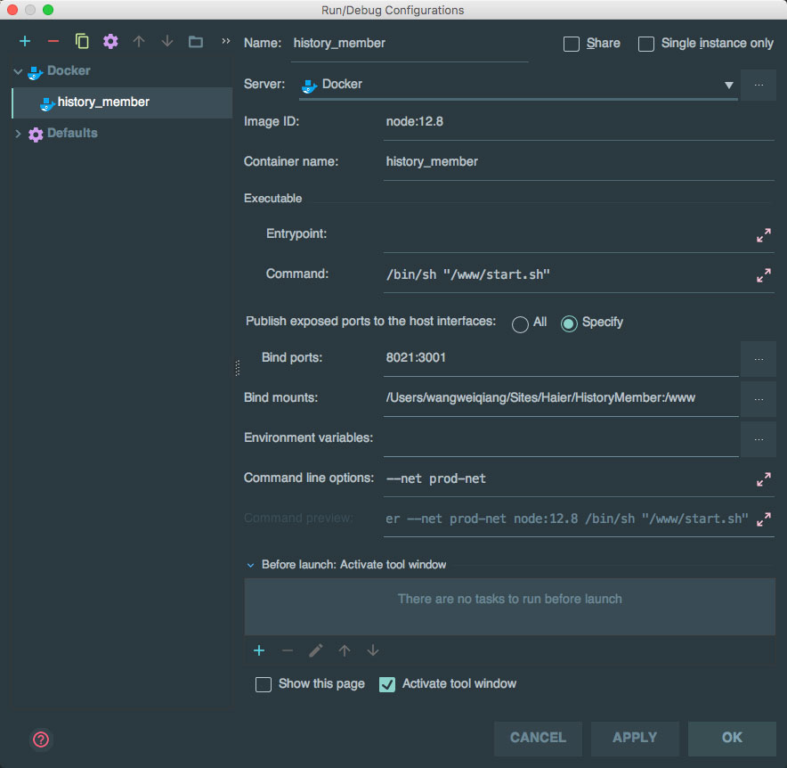

# 安装
基于本项目 Dockerfile 部署项目    
逻辑：容器启动时，加载项目下的 startup.sh 文件，启动NPM服务生成 dist 目录，并启用 devServer 占用 3001 端口开放服务，对外映射为 8022 端口（映射端口按需求调整）    
目录： /home/sites/history_admin_prod/（按需求调整）    
影像：image_history_admin_prod    
工作容器：history_admin_prod    

## 1. Docker安装
下载安装Docker主环境

## 2. 创建项目文件夹 并 检出项目到此文件夹  
`mkdir /home/sites/history_admin_prod`

## 3. 确认网络情况
建议基于虚拟网络运行，请使用 `docker network ls` 查询网络 `prod-net` 是否存在。  
不存在请使用以下命令新建  
```
docker network create --driver=bridge --subnet=172.100.0.0/16 prod-net
```

## 4. 构建影像
请先 cd 到项目目录，再用下一行命令构建：   
```
cd /home/sites/history_admin_prod
docker build -t image_history_admin_prod  -f ./Dockerfile .
```


## 5. 环境构建

### 5.1. 场景一：本地研发   
本地推荐生成容器后，手动启动容器和启动应用。   
请勿设置自动启动，以防代码出错时，容器无限自启，导致无法正常进入容器。     
本项目需要调用后端程序API服务器，请确认对应服务所在容器，在下一步以及Nginx配置中会用到，以 `history_server_prod:9501` 为例   
1. 配置API服务器 到 webpack.config.js 文件中 50 行位置  
2. 创建容器  
```
docker run -ti -p 8022:3001  -v /home/sites/history_admin_prod:/www  --name history_admin  --net prod-net -d  image_history_admin_prod
```
3. 进入容器： `docker exec -it history_admin /bin/bash`  
4. 启动程序：  `npm run dev`
    如果`package.json`有变化，需要使用 `npm install` 安装   
然后可以使用 localhost:8022 访问项目了。


### 5.2. 场景二：Jet Brains 相关 IDE  
直接在编辑器中配置：


### 5.3. 场景三：服务器部署（开发、测试、生产）环境  
服务器部署使用自动重启，并指定启动bash，以便无人值守，当docker服务启动时自动启动容器和项目  
注意给于`start.sh`足够的权限
```
chmod 777 start.sh

docker run -ti -p 8022:3001  -v /home/sites/history_admin_prod:/www --restart=always   --name history_admin_prod --net prod-net -d  image_history_admin_prod /www/start.sh
```
Jenkins部署时：
1.  `docker stop history_admin_prod`   
2.  部署history_admin_prod文件  
3.  `docker start history_admin_prod`  


### 5.4. 场景四：Docker-composer部署
```
 history_admin_prod:
   image: node:12.8
   working_dir: /www
   volumes:
     - /home/sites/history_admin_prod:/www/:rw
   ports:
     - "8022:3001"
   container_name: history_admin_prod
   environment:
     - TZ=Asia/Shanghai
   command: /bin/bash -c "npm install && npm run dev"
#   extra_hosts:
#     - "apiserver:172.20.0.41"
   restart: always
   networks:
     dev-net:
       ipv4_address: 172.20.0.53
     prod-net:
       ipv4_address: 172.21.0.53
```


## 6. Nginx相关
本项目启动后，可以直接使用 8022 访问，如需要配置域名、配置静态资源、使用反向代理解析，请使用以下两种方式：  

### 6.1 方式一：直接将Nginx的Root指向生成的dist目录  
注意配置时，同时把 api 重写至 history_server_prod 后端服务器
```
server {
    listen       80;
    server_name  yunpr.haier.net;
    index  index.html index.htm;
    access_log   /var/log/nginx/history_admin_prod.log;
    error_log   /var/log/nginx/history_admin_prod.error.log;

    root /wwwroot/history_admin_prod/dist;

   // 所有api接口指向history_server_prod容器
   location  ^~ /api/ {
       proxy_set_header X-Scheme $scheme;
       proxy_set_header X-Forwarded-For $proxy_add_x_forwarded_for;
       proxy_set_header Host $http_host;
       proxy_redirect off;
       proxy_pass http://history_server_prod:9501/user/v1/;
   }
   // 重写掉vue的#标记
   location / {
        try_files $uri $uri/ /index.html?$query_string;
    }

}
```

### 6.2 方式二：反向代理至 history_admin_prod 容器的 devServer  
```
server {
    listen       80;
    server_name  history.haier.net;
    index  index.html index.htm;
    access_log   /var/log/nginx/history_admin_prod.log;
    error_log   /var/log/nginx/history_admin_prod.error.log;
    // root 没用了可以随便写
    root /wwwroot/history_admin_prod;
    // 转发所有请求至本项目容器
    location / {
         proxy_pass  http://history_admin_prod:3001;
         proxy_redirect     off;
         proxy_set_header   Host             $host;
         proxy_set_header   X-Real-IP        $remote_addr;
         proxy_set_header   X-Forwarded-For  $proxy_add_x_forwarded_for;
         proxy_next_upstream error timeout invalid_header http_500 http_502 http_503 http_504;
         proxy_max_temp_file_size 0;
         proxy_connect_timeout      90;
         proxy_send_timeout         90;
         proxy_read_timeout         90;
         proxy_buffer_size          4k;
         proxy_buffers              4 32k;
         proxy_busy_buffers_size    64k;
         proxy_temp_file_write_size 64k;
    }

}
